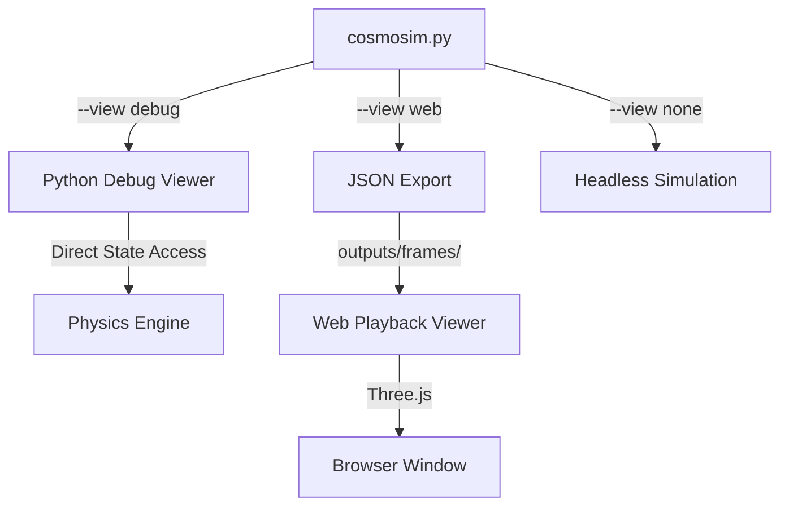

# CosmoSim Viewer Architecture

CosmoSim utilizes a **Two-Viewer Strategy** to balance the needs of real-time development debugging and high-fidelity presentation.

## Architecture Diagram

## 1. Python Debug Viewer (`viewer/viewer.py`)
**Role:** Development & Physics Verification
- **Technology:** Matplotlib + JAX
- **Input:** Live `UniverseState` from simulation loop.
- **Features:**
    - Real-time interaction (pause, step, reset).
    - Physics overlays (velocity vectors, forces, trajectories).
    - Entity inspection (click to see mass, radius, ID).
    - Immediate feedback loop for code changes.

## 2. Web Playback Viewer (`viewer/test.html`)
**Role:** Presentation & Analysis
- **Technology:** Three.js (WebGL)
- **Input:** JSON files exported to `outputs/frames/`.
- **Features:**
    - Smooth 60FPS playback of large datasets.
    - Cinematic camera controls (Orbit, Auto-Follow).
    - Topology visualization (3D overlays for Torus/Sphere).
    - Portable (can be hosted on static web servers).

## Scenario Loading
All simulations are defined as **Scenarios** in the `scenarios/` directory. The CLI loads these dynamically:
1.  User runs `python cosmosim.py --scenario my_scenario`
2.  CLI looks for `scenarios/my_scenario.py`
3.  CLI calls `build_config()` and `build_initial_state()`
4.  CLI routes execution to the selected Viewer or Headless runner.
